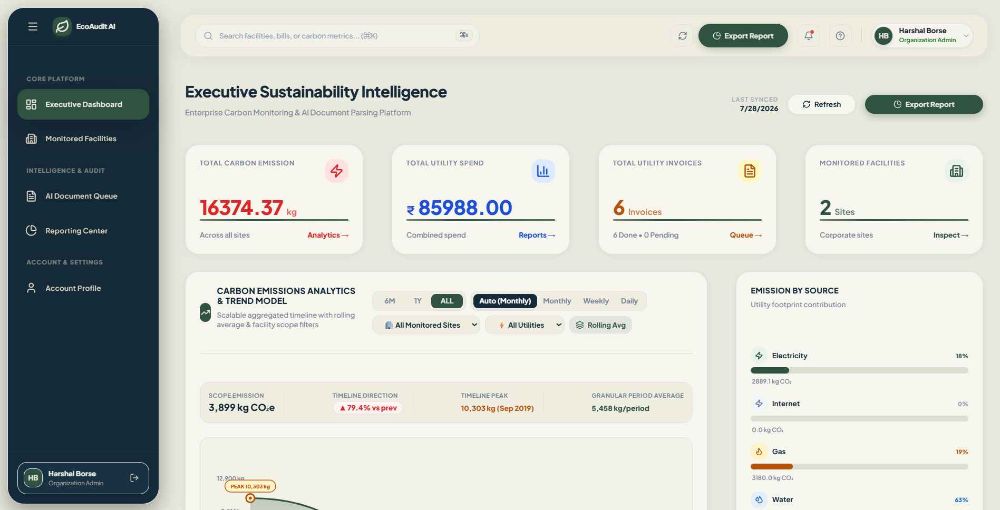
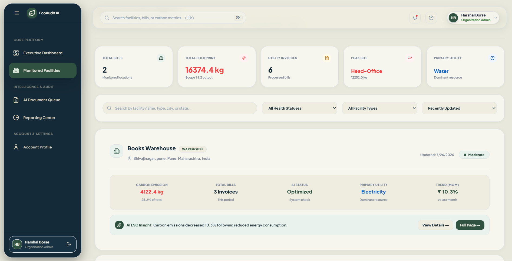
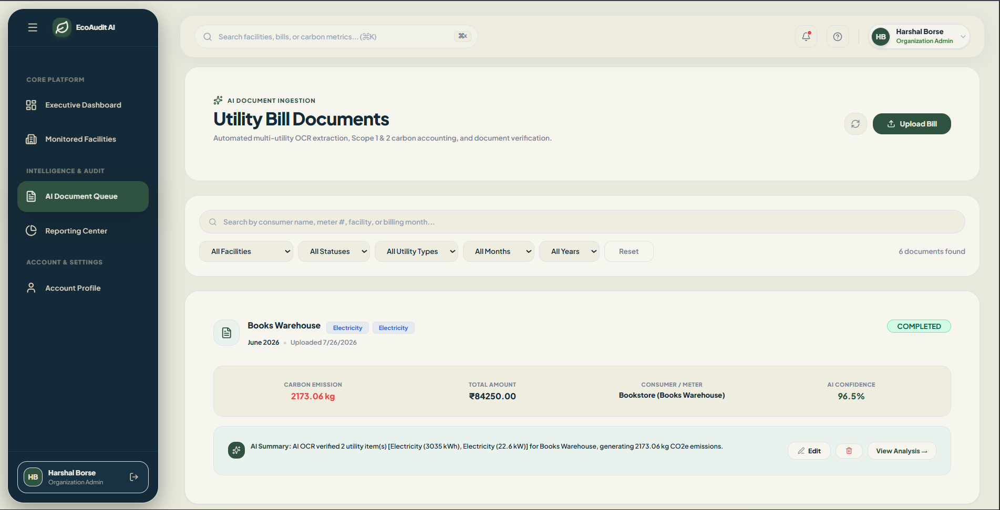
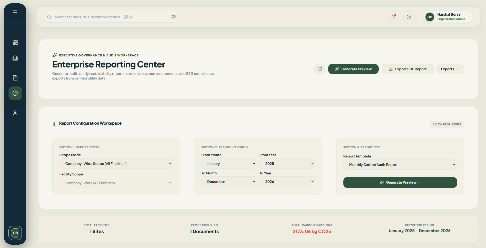

# EcoAudit AI

<p align="center">
  <strong>Enterprise carbon governance platform for utility bill intelligence, facility monitoring, AI extraction, and executive sustainability reporting.</strong>
</p>

<p align="center">
  
  
  
  
  
</p>

<p align="center">
  
  
  
</p>

---

## Overview

EcoAudit AI is a minimal, modern enterprise platform that helps organizations convert utility bills into carbon intelligence.

The product is designed for a company workspace model. Each organization gets its own set of facilities, bills, analytics, and reports. Users can upload utility documents, let AI extract structured data, calculate emissions, track performance, and generate executive-ready sustainability reports.

The UI follows a clean SaaS layout with a premium sidebar, soft cards, rounded surfaces, and restrained colors so the product feels polished, readable, and professional.

---

## What This Project Does

EcoAudit AI brings the full carbon reporting workflow into one place:

* Organization signup and login
* Facility creation and tracking
* Utility bill upload and processing
* AI-powered OCR and field extraction
* Carbon emission calculation from utility usage
* Dashboard analytics and trend tracking
* AI sustainability insights and recommendations
* Executive PDF reporting for review and auditing

---

## Key Features

### 1. Organization Workspace

Each company signs up into its own workspace. Data is scoped by organization so users only see their own facilities, bills, and reports.

### 2. Dashboard

The dashboard summarizes the most important metrics in one view:

* Total carbon emission
* Utility spend
* Utility invoices
* Monitored facilities
* Carbon trend
* Utility source breakdown
* AI-generated sustainability insights

### 3. Monitored Facilities

Facilities can be added, searched, filtered, and reviewed. The app tracks facility-level emissions and utility activity so managers can quickly identify high-impact sites.

### 4. Utility Bill Documents

Users can upload utility bills and review the extracted data in a document drawer. The system supports bill status tracking, AI extraction, raw JSON inspection, preview views, and reprocessing for failed documents.

### 5. AI Carbon Intelligence

The platform calculates emissions from utility data and uses AI to generate observations, priorities, and suggestions based on the organization’s own usage patterns.

### 6. Enterprise Reporting Center

The reporting module generates a structured PDF report for executive and ESG review. It includes summary metrics, utility analysis, facility performance, bill processing status, and recommendations.

### 7. Minimal SaaS UI

The product uses a soft, enterprise style:

* dark sidebar
* light canvas background
* rounded cards
* subtle borders
* calm accent colors
* simple hierarchy
* responsive layouts
* smooth transitions and hover states

---

## Tech Stack

### Frontend

* React
* Vite
* React Router
* Axios
* Framer Motion
* Lucide React
* Bootstrap

### Backend

* Node.js
* Express
* Prisma
* MySQL
* JWT authentication
* bcrypt
* multer
* pdfkit
* AWS SDK for S3 storage
* AI provider integrations for extraction and analysis

### Infrastructure

* AWS S3 for file storage
* Multi-tenant company-based architecture
* AI document intelligence pipeline
* PDF report generation workflow

---

## Project Structure

```text
EcoAudit-AI/
├── backend/
├── database/
├── frontend/
│   ├── public/
│   ├── src/
│   │   ├── components/
│   │   ├── hooks/
│   │   ├── layouts/
│   │   ├── pages/
│   │   ├── services/
│   │   └── utils/
│   ├── index.html
│   ├── package.json
│   ├── vite.config.js
│   └── vercel.json
├── screenshots/
└── README.md
```

---

## Main Pages

* `Dashboard.jsx`
* `Facilities.jsx`
* `FacilityDetail.jsx`
* `Bills.jsx`
* `Reports.jsx`
* `Profile.jsx`
* `Login.jsx`
* `Signup.jsx`

---

## Design Language

The interface is intentionally minimal and premium.

### Visual Direction

* dark and clean navigation rail
* soft off-white content background
* rounded containers
* low-contrast borders
* well-spaced sections
* green as the main accent color
* no harsh admin-panel styling

### UI Feel

* modern
* calm
* trustworthy
* executive-friendly
* easy to scan
* suitable for ESG and sustainability workflows

---

## How It Works

### 1. Organization Signup

A company creates an account and gets a tenant-scoped workspace.

### 2. Add Facilities

The organization adds buildings, sites, offices, or plants that will be monitored.

### 3. Upload Bills

Users upload electricity, water, gas, diesel, or multi-utility invoices.

### 4. AI Extraction

The backend extracts invoice fields and utility data from the document.

### 5. Carbon Calculation

The system calculates emissions from the extracted utility usage.

### 6. Review and Report

The data is shown in the dashboard, facility views, and reporting center.

---

## Environment Variables

### Backend `.env`

```env
DATABASE_URL=
JWT_SECRET=
PORT=5000
FRONTEND_URL=
AWS_REGION=
AWS_ACCESS_KEY_ID=
AWS_SECRET_ACCESS_KEY=
AWS_S3_BUCKET=
GEMINI_API_KEY=
OPENROUTER_API_KEY=
```

### Frontend `.env`

```env
VITE_API_URL=
```

---

## Local Setup

### 1. Clone the repository

```bash
git clone <your-repo-url>
cd EcoAudit-AI
```

### 2. Start the backend

```bash
cd backend
npm install
npx prisma generate
npx prisma migrate dev
npm run dev
```

### 3. Start the frontend

```bash
cd frontend
npm install
npm run dev
```

---

## Production Build

### Frontend

```bash
cd frontend
npm run build
```

### Backend

Deploy the backend to your preferred Node.js hosting platform and configure the environment variables correctly.

---

## Screenshots

### Dashboard Page


---

### Facilities Page


---

### Utility Bill Page


---

### Reports Generate Page


